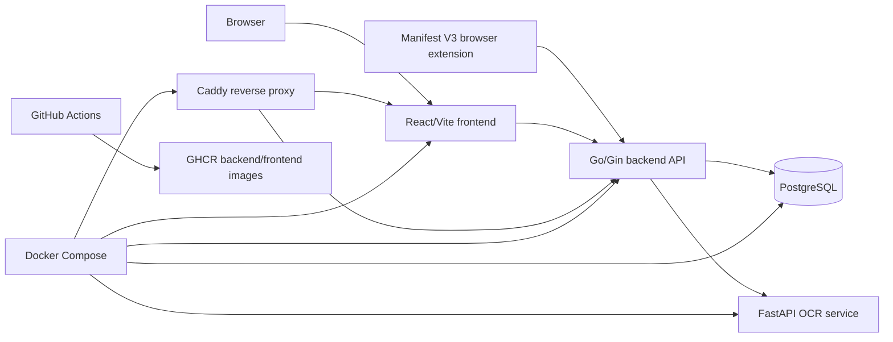

# Architecture

JobOps Tracker is a small full-stack application with optional capture and deployment tooling.

## Components

### React Frontend

Location: `apps/frontend`

The frontend implements the public landing/auth page, authenticated dashboard, application forms, filters, pagination, analytics views, CSV import/export, capture review modal, CV version management, theme toggle, and Cypress tests.

### Go/Gin Backend

Location: `apps/backend`

The backend exposes authentication, applications, CSV, CV versions, dashboard analytics, capture analyze, health, and metrics routes. It uses PostgreSQL through `pgx`.

### PostgreSQL

Migrations live in `apps/backend/migrations`. The current model includes users, OTPs, sessions, applications, status history, and CV versions.

### Caddy

Location: `infra/caddy`

Caddy terminates public HTTP/HTTPS traffic in production Compose, proxies `/api/*` to the backend, proxies the frontend, adds HSTS, and blocks common sensitive probe paths.

### Browser Extension

Location: `apps/browser-extension`

The extension captures visible tab data after a user click and sends it to the JobOps API. It opens JobOps with a reviewable `/capture?payload=...` URL.

### OCR Service

Location: `apps/capture-ocr-service`

The Python/FastAPI service receives capture data, optionally runs PaddleOCR when visible text is sparse, and returns extracted job fields.

### Docker Compose

Local Compose: `infra/docker/docker-compose.yml`

Production Compose: `infra/docker/docker-compose.prod.yml`

Both include PostgreSQL, backend, frontend, and capture OCR service. Production also includes Caddy.

### Optional Kubernetes And Helm

Raw manifests live in `infra/kubernetes`. The Helm chart lives in `infra/helm/jobops-tracker`. These are repository deployment assets; the documented live runtime is Docker Compose.

### CI/CD

GitHub Actions workflows:

- `ci.yml`: backend tests, frontend build/Cypress, browser-extension tests/validation/package build, Docker builds, Helm lint/template.
- `release-images.yml`: backend and frontend image publishing on `v*` tags.
- `deploy-vps.yml`: manual VPS deploy workflow.

## Data Flow

1. User signs in with OTP.
2. Backend creates an HttpOnly session cookie.
3. Authenticated frontend calls protected backend APIs with `credentials: include`.
4. Backend scopes application, CV, dashboard, and CSV queries by authenticated user ID.
5. Capture analyze requests are public but do not write to the database.
6. Saving a captured job uses the authenticated application create endpoint.
